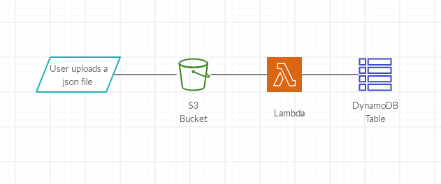

Creating an environment with the following services :
	
- S3 
- Dynamodb
- Lambda
- IAM

## Scenario 

- Create a AWS lambda which will be invoked when we upload an artifact of .json type in S3 bucket and performs the operation of reading data from json file and storing it inside DynamoDB table.
- As a part of the scenario, we will first setup the awscli and configure it with the security credentials. After that will create the cloudformation template to generate resources like S3 bucket,IAM role and policy, Lambda and a DynamoDB table.
- Once we have the required cloudformation template ready, we will deploy that to our AWS account using awscli commands.
- As soon as we have our infrastructure ready which is created using cloudformation template, we will then upload a JSON object to S3 bucket and then check the DynamoDb table if it contains the entry of data present inside S3 object.

## Services

- S3 : Amazon Simple Storage Service (Amazon S3) is an object storage service that offers scalability, data availability, security, and performance.Amazon S3 has a simple web services interface that you can use to store and retrieve any amount of data, at any time, from anywhere on the web.
- IAM : AWS Identity and Access Management (IAM) enables you to manage access to AWS services and resources securely. Using IAM, you can create and manage AWS users and groups, and use permissions to allow and deny their access to AWS resources.
- DynamoDB - Amazon DynamoDB is a key-value and document database that delivers single-digit millisecond performance at any scale. It's a fully managed, multiregion, multimaster, durable database with built-in security, backup and restore, and in-memory caching for internet-scale applications.
- Lambda - AWS Lambda is a serverless compute service that runs your code in response to events and automatically manages the underlying compute resources for you.

